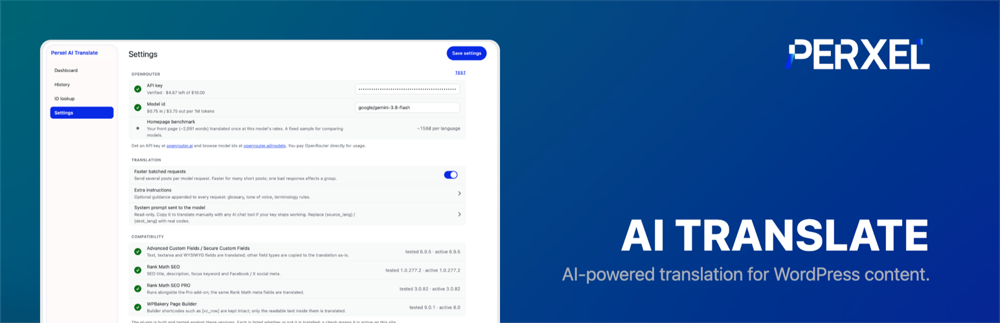
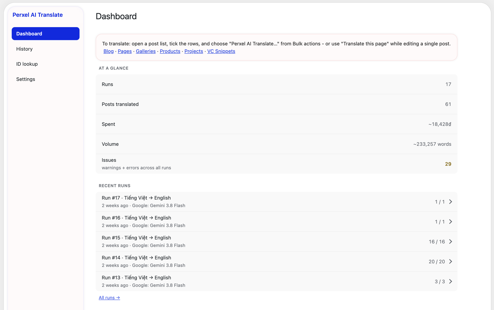
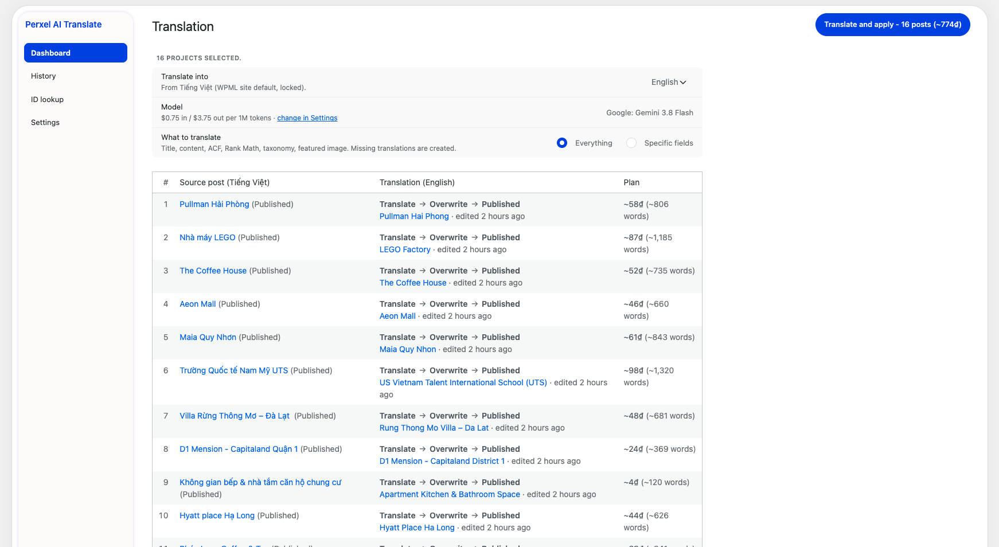
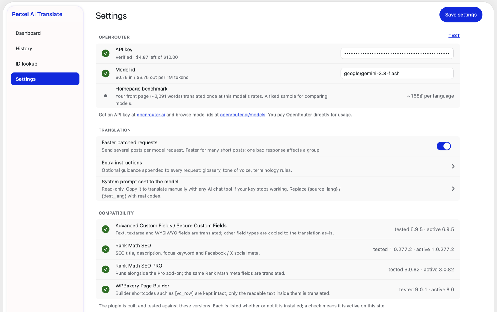
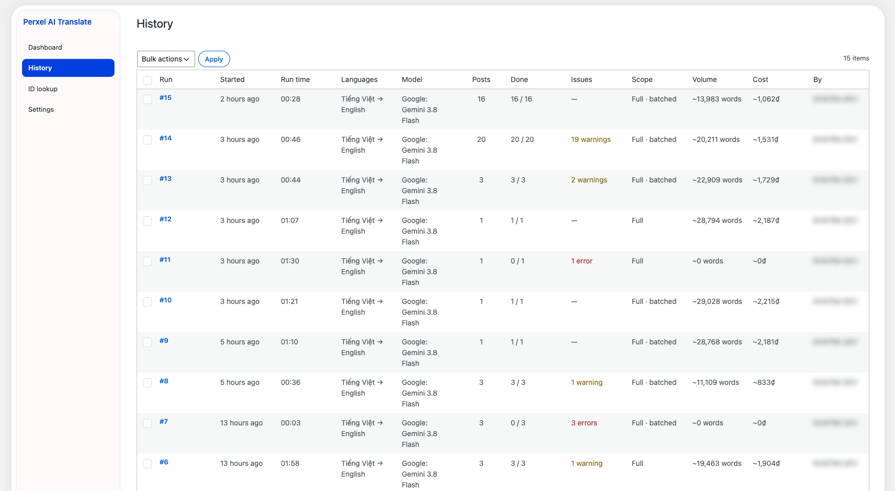

# Perxel AI Translate

**Free and open source.** A WordPress plugin that bulk-translates your **WPML**
content with an AI model of your choice, through
[OpenRouter](https://openrouter.ai/). You pay OpenRouter directly for model
usage - there is no plugin fee, no subscription, and no WPML AI translation
credits are spent.

> By [Perxel](https://perxel.com/). Licensed GPL-2.0-or-later. On the
> WordPress.org plugin directory as `perxel-ai-translate`.

## Cheap enough to translate a whole site

On one production site - roughly **1,000 posts, ~2.8 million words** - a full
translation pass (titles, content, ACF fields, Rank Math SEO meta, taxonomies
and featured images) cost **under $5** in OpenRouter usage. Putting the same
content through WPML's own AI translation would have cost on the order of
**600x more**.

The exact number is entirely down to the model you choose - the model is a
setting, never hard-coded - but a current Gemini Flash class model is more than
good enough for normal web content and runs at a few cents per thousand words.
Every run shows a cost estimate before it starts and records what it actually
spent.

## Screenshots

### Dashboard


How to start a translation, all-time run and word totals, and recent runs.

### Translation screen


Destination language, model and rates, what to translate, and a per-post plan
with a cost and word-count estimate before anything runs.

### Settings


Your OpenRouter key and model, batching and glossary options, and which
companion plugins (ACF, Rank Math, WPBakery) are detected.

### History


Every run with its languages, model, post count, warnings or errors, word
volume and cost.

## What it does

- A **Tools → AI Translate** admin area: Dashboard, History, ID lookup and
  Settings, plus a Translation screen and a live Run screen reached mid-task.
- Pick posts with a **Perxel AI Translate…** bulk action on any
  WPML-translatable post type, or the *Translate this page* toolbar item while
  editing a single post. Both land on the same Translation screen for exactly
  those posts - there is no persistent, accumulating list.
- The Translation screen takes a destination language and a data selection and
  shows a cost / word-count estimate before anything runs. Costs display in USD,
  or in VND on sites whose WPML default language is Vietnamese.
- Press **Translate and apply**. Each post is translated and written straight
  into WordPress as a WPML translation - review it in the normal editor. Close
  the tab any time; reopen the run and press **Resume** to carry on where it
  left off.
- The AI model is a setting: enter any OpenRouter model id, press *Test model*
  to verify it and pull its live pricing. Each run snapshots the model id and
  rates so historical costs stay correct.
- Translates: title and slug, excerpt and content (HTML and page-builder
  shortcodes such as `[vc_row]` are preserved - only the readable text is sent),
  ACF text / textarea / WYSIWYG fields including nested Groups, Repeaters and
  Flexible Content, Rank Math SEO fields, taxonomy terms (remapped to their WPML
  translations), and the featured image.
- **Faster batched requests** (on by default) sends several short posts per
  model request; turn it off to translate one post per request.

## Requirements

- WordPress 6.2+, PHP 7.4+
- WPML (Multilingual CMS or higher) with at least two active languages - the
  plugin stays inactive without it
- An [OpenRouter](https://openrouter.ai/) account and API key

## Tested with

- WordPress 7.1
- WPML 4.9.7
- Secure Custom Fields 6.9.5 (and Advanced Custom Fields)
- Rank Math SEO 1.0.277.2 / Rank Math SEO PRO 3.0.82
- WPBakery Page Builder 9.0.1

## Install

From the WordPress.org directory (once listed): **Plugins → Add New**, search
for "Perxel AI Translate", install and activate.

Or install the latest build directly:

```
https://github.com/perxel/wp-ai-translate/releases/latest/download/perxel-ai-translate.zip
```

Upload it under **Plugins → Add New → Upload Plugin**, activate, then open
**Tools → AI Translate → Settings** and add your OpenRouter API key.

## Development

```bash
composer install
composer run lint      # PHP_CodeSniffer (WordPress standard)
composer run lint:fix  # phpcbf
```

Build an installable / WordPress.org submission zip (only committed files,
minus everything in `.distignore`):

```bash
composer run build          # or: bin/build-zip.sh
bin/build-zip.sh --dirty    # include uncommitted changes
# → dist/perxel-ai-translate.zip
```

Regenerate the translation template:

```bash
wp i18n make-pot . languages/perxel-ai-translate.pot
```

### Extending

```php
// Cap how many parallel browser workers a batched run uses (default 2).
add_filter( 'pxat_batch_worker_count', fn () => 3 );
```

The AI model, its pricing and its limits are stored settings - set them on
**Tools → AI Translate → Settings**, not in code.

## Releasing

1. Bump the version in `perxel-ai-translate.php` (header **and** `PXAT_VERSION`),
   `readme.txt` (`Stable tag`), and add a changelog entry. Commit to `main`.
2. Create a **GitHub Release** with the tag = the new version (e.g. `0.0.2`).

`release.yml` then runs automatically on the published Release and does two
things:

| Job | What it does |
| --- | --- |
| `zip` | Builds `perxel-ai-translate.zip` with `bin/build-zip.sh` and **attaches it to the release**. Works immediately. |
| `deploy` / `assets` | Pushes the version to the WordPress.org SVN repo and updates the `.org` readme and listing assets. Only works **after** the plugin's first submission has been approved, and needs the repo secrets `SVN_USERNAME` / `SVN_PASSWORD`. |

The zip is a build artifact - it is **not** committed to the repo (`dist/` is
git-ignored). The stable download URL for the latest build is
`https://github.com/perxel/wp-ai-translate/releases/latest/download/perxel-ai-translate.zip`.

Listing assets (icon, banner, screenshots) live in `.wordpress-org/` and are
pushed to SVN on the same `release.yml` run.

## License

GPL-2.0-or-later. See [LICENSE](LICENSE). Issues and pull requests welcome.
